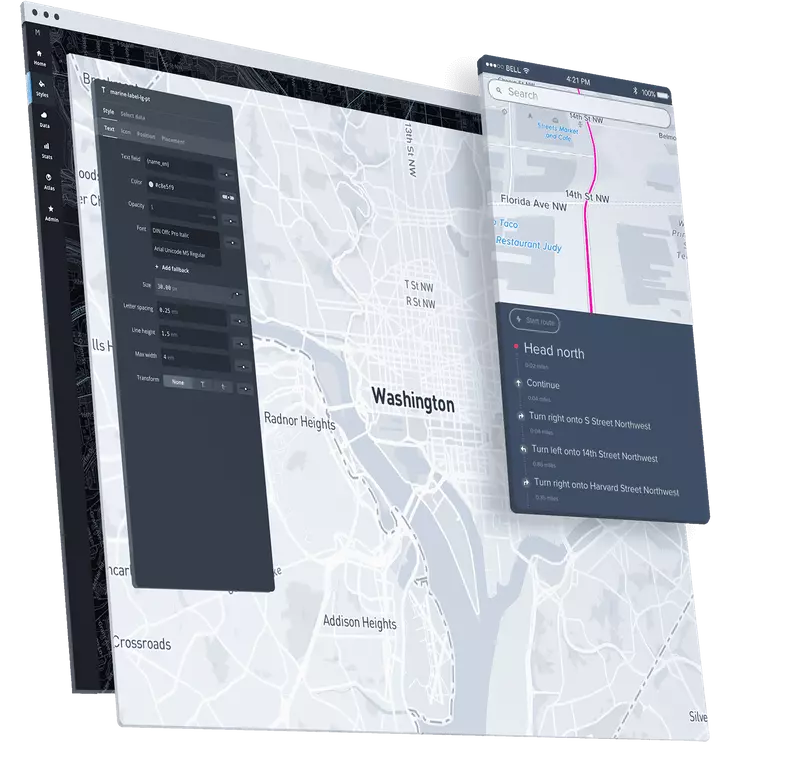
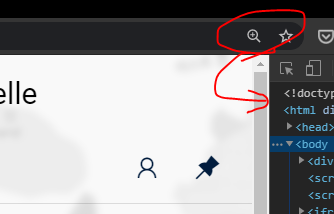

[](https://gitpod.io/#https://github.com/bichikim/winter-love-quasar) 

# Quasar App

> WIP

## UI Example




## Trouble Shooting

### Cannot run karma by web-storm IDE

Set TS_NODE_PROJECT=null in your config

### SSL Error in DEV mode

> An SSL certificate error occurred when fetching the script.


Windows

- close all windows of chrome first

```
/Applications/Google/Chrome/Canary.app/Contents/MacOS/Google/Chrome
 --ignore-certificate-errors
 --unsafely-treat-insecure-origin-as-secure=https://localhost:8080
```

## Security

### Expect-CT header

https://securityheaders.com/

https://developer.mozilla.org/ko/docs/Web/HTTP/Headers/Expect-CT
https://atinove.com/post/5e6d87f1d215fd0a9d45f005/

### Web Application Firewall (WAF)

## Known issue 


### browser zoom sometimes makes a scrollbar (quasar bug)




### css backdrop filter in firefox

Not support yet 

1. about:config

2. layout.css.backdrop-filter.enabled should be true for it


### Content-Security-Policy  style-src unsafe-inline 

unsafe-inline may be dangerous
