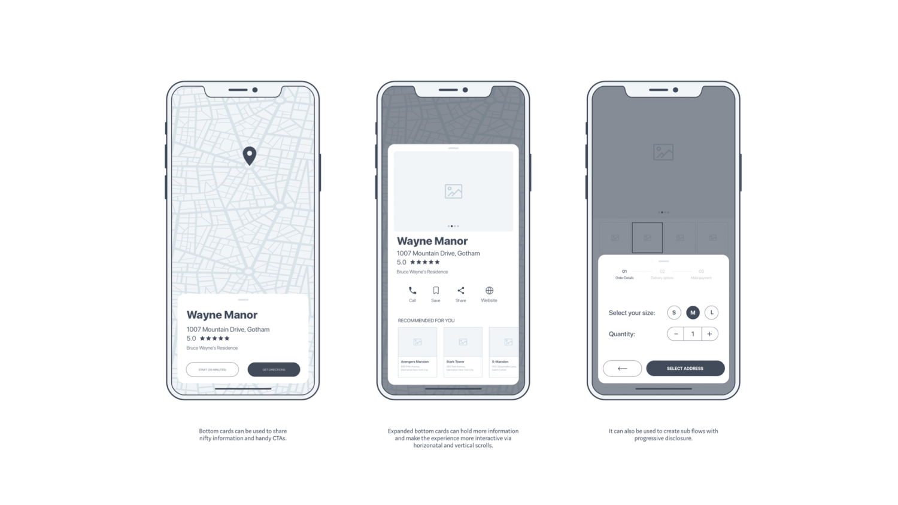

# Quasar App

> WIP

## UI Example




## Trouble Shooting

### Cannot run karma by web-storm IDE

Set TS_NODE_PROJECT=null in your config

### SSL Error in DEV mode

> An SSL certificate error occurred when fetching the script.


Windows

- close all windows of chrome first

```
/Applications/Google/Chrome/Canary.app/Contents/MacOS/Google/Chrome
 --ignore-certificate-errors
 --unsafely-treat-insecure-origin-as-secure=https://localhost:8080
```


## Known issue 

### .env should be added to .gitignore

